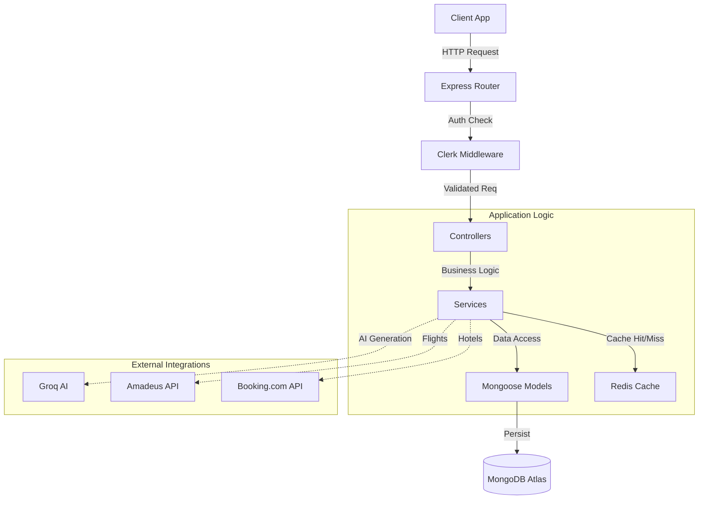

# ⚡ AdventureNexus API Server

[](https://git.io/typing-svg)

---

<!-- Tech Stack Badges -->
[](https://nodejs.org/)
[](https://expressjs.com/)
[](https://www.typescriptlang.org/)
[](https://mongodb.com/)
[](https://redis.io/)
[](https://clerk.com/)
[](https://swagger.io/)

The **AdventureNexus Backend** is the powerhouse behind the AI travel planning experience. It orchestrates complex data flows between the AI engine (Groq), external travel data providers (Amadeus, Booking.com), and the user interface, all while ensuring security and speed.

---

## 🏗️ System Architecture

The backend follows a **Controller-Service-Repository** pattern for separation of concerns and maintainability.



---

## 🏗️ Key API Modules

| Module | Base Route | Description |
| :--- | :--- | :--- |
| **Auth & Users** | `/api/v1/users` | User profile management and Clerk webhook handling. |
| **Planning** | `/api/v1/plans` | Core AI itinerary generation, recommendations, and galleries. |
| **Reviews** | `/api/v1/reviews` | Trip feedback management with filtering and likes. |
| **Liked Plans** | `/api/v1/liked-plans` | Management of user's favorite travel itineraries. |
| **Hotels** | `/api/v1/hotels` | AI-powered hotel recommendations for travel plans. |
| **Mail** | `/api/v1/mail` | Newsletter and daily travel tips automated delivery. |

> 📘 **Interactive Documentation**: AdventureNexus is fully documented using **Swagger/OpenAPI**. Host the server and visit `/api-docs` to explore live endpoints.

---

## 📂 Project Structure

```text
Backend/src
├── config/             # Environment & App Configuration
├── controller/         # Request Handling Logic
│   ├── newsSubscriptionController/
│   ├── recommendationController/
│   └── ...
├── Database/           # Database Connection & Models
├── jobs/               # Cron Jobs (Daily Tips, Cleanup)
├── middlewares/        # Auth, Validation, Error Handling
├── redis/              # Redis Client Setup
├── routes/             # API Route Definitions
├── service/            # Business Logic & External API Calls
└── utils/              # Helper Functions & Types
```

---

- **Helmet**: Secures HTTP headers against common vulnerabilities.
- **Rate Limiting**: Intelligent limits to prevent abuse of AI and image services.
- **Professional Caching**: 
    - **Namespaced Keys**: Organised via `nexus:v1:<prefix>:<id>` for strict isolation.
    - **Key Normalization**: Alphabetical query sorting to ensure consistent cache hits.
    - **Proactive Invalidation**: Automated cache clearing (e.g. clearing review lists when a new like is added).
    - **Middleware Integration**: Efficient, non-intrusive caching for all high-traffic GET routes.

---

## 🚀 Getting Started

### Prerequisites
- Node.js (v18+)
- MongoDB connection string
- Redis instance (local or cloud)
- API Keys: Clerk, Amadeus, Groq, Cloudinary

### Setup

1. **Install Dependencies**
    ```bash
    npm install
    ```

2. **Configure Environment**
    Create a `.env` file in the `Backend` directory:
    ```env
    PORT=3000
    DB_URI=mongodb+srv://...
    CLERK_PUBLISHABLE_KEY=pk_test_...
    CLERK_SECRET_KEY=sk_test_...
    GROQ_API_KEY=gsk_...
    AMADEUS_CLIENT_ID=...
    AMADEUS_CLIENT_SECRET=...
    REDIS_URL=redis://localhost:6379
    ```

3. **Run Server**
    ```bash
    # Development Mode
    npm run dev
    
    # Production Build
    npm run build
    npm start
    ```

---

## 🤝 Contributing

Please refer to the root `CONTRIBUTING.md` for guidelines.

Made with ☕ and TypeScript.
