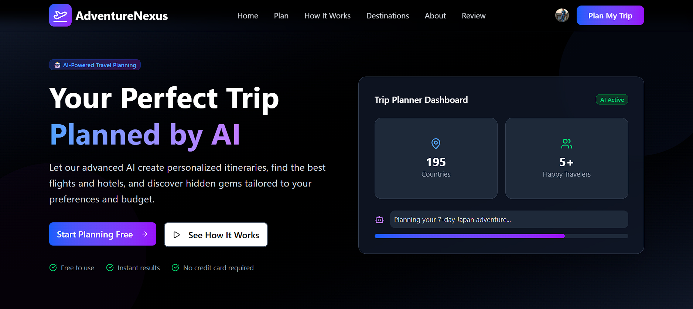
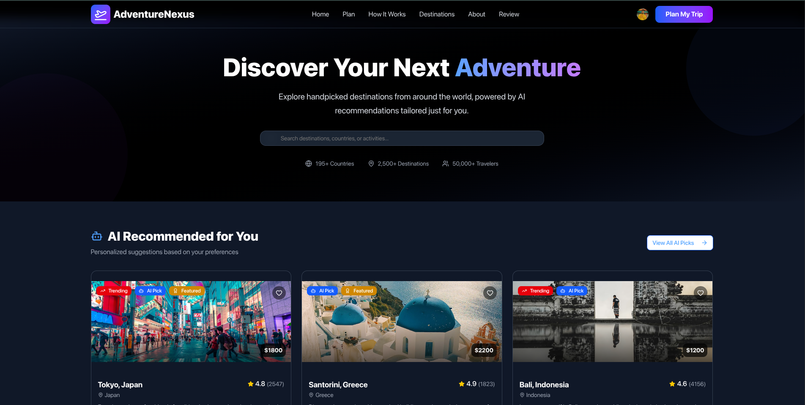
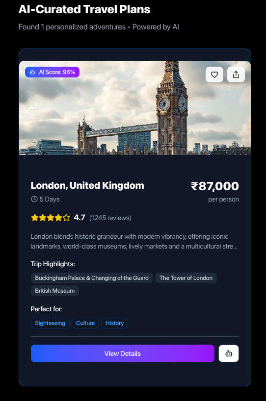

# 🌍 A d v e n t u r e  N e x u s
### *Transform your travel planning experience with AI-powered personalized itineraries*

[](https://git.io/typing-svg)

---

<!-- Tech Stack Badges -->
[](https://react.dev/)
[](https://tailwindcss.com/)
[](https://nodejs.org/)
[](https://expressjs.com/)
[](https://mongodb.com/)
[](https://redis.io/)
[](https://clerk.com/)

[](LICENSE)
[](https://github.com/yourusername/adventurenexus/graphs/commit-activity)
[](http://makeapullrequest.com)

[Live Demo](https://adventurenexus.vercel.app) • [Report Bug](https://github.com/yourusername/adventurenexus/issues) • [Request Feature](https://github.com/yourusername/adventurenexus/issues)

---

## 📚 Table of Contents
- [🌍 About The Project](#-about-the-project)
- [✨ Key Features](#-key-features)
- [📸 Screenshots](#-screenshots)
- [🛠️ Tech Stack](#️-tech-stack)
- [🧩 Architecture](#-architecture)
- [🚀 Getting Started](#-getting-started)
- [🤝 Contributing](#-contributing)
- [📜 License](#-license)
- [📞 Contact](#-contact)

---

## 🌍 About The Project

> **Problem**: Traditional travel planning is time-consuming (10–15 hours/trip), fragmented, and generic.  
> **Solution**: **AdventureNexus** cuts this down to minutes using AI.

**AdventureNexus** is your intelligent travel companion. By leveraging **Generative AI** and real-time travel APIs, we create fully personalized travel experiences. Whether you're a backpacker on a budget or looking for luxury, our engine tailors every aspect of your trip—from destinations and daily itineraries to flight & hotel bookings.

### 🌟 Why AdventureNexus?
- **⏱️ Save Time**: Plan complex trips in under 2 minutes.
- **🎯 Personalized**: Recommendations based on *your* specific interests (food, history, adventure, etc.).
- **💰 Cost-Effective**: Real-time budget optimization ensures you get the best value.

---

## ✨ Key Features

| Feature | Description |
| :--- | :--- |
| 🧠 **AI Match Score** | Intelligent destination scoring (0–100%) based on your profile using **Groq API**. |
| 📅 **Smart Itineraries** | Day-by-day auto-generated plans including activities, locations, and timings. |
| 💰 **Budget Optimizer** | Detailed cost breakdown for flights, stays, food, and activities. |
| ✈️ **Flight Search** | integrated **Amadeus API** for real-time flight availability and pricing. |
| 🏨 **Hotel Finder** | **Booking.com** integration to find the best places to stay. |
| 🔐 **Secure Access** | Enterprise-grade authentication via **Clerk**. |
| 🛡️ **Robust Security** | Redis caching, Rate limiting, and CORS protection. |
| 📊 **Dashboard** | Save, manage, and share your travel plans easily. |

---

## 📸 Screenshots

### 🖥️ Desktop Experience

**Landing Page**  


**Smart Search**  


**Plan Review**  


**Generated Results**  


### 📱 Mobile Responsiveness

    

---

## 🛠️ Tech Stack

### 🎨 Frontend (Client)
- **Framework**: [React 18](https://react.dev/)
- **Build Tool**: [Vite](https://vitejs.dev/)
- **Styling**: [Tailwind CSS v4](https://tailwindcss.com/) & [Shadcn/UI](https://ui.shadcn.com/)
- **Icons**: [Lucide React](https://lucide.dev/)
- **State Mgmt**: [Zustand](https://github.com/pmndrs/zustand)
- **Animations**: [Framer Motion](https://www.framer.com/motion/)

### ⚙️ Backend (Server)
- **Runtime**: [Node.js](https://nodejs.org/) &amp; [Express.js](https://expressjs.com/)
- **Database**: [MongoDB](https://www.mongodb.com/) (NoSQL)
- **Caching**: [Redis](https://redis.io/) (via IOredis)
- **Language**: [TypeScript](https://www.typescriptlang.org/)

### 🤖 AI & APIs
- **LLM Engine**: [Groq SDK](https://groq.com/)
- **Image Gen**: [Pollinations AI](https://pollinations.ai/)
- **Travel Data**: [Amadeus](https://developers.amadeus.com/) & [Booking.com](https://rapidapi.com/tipsters/api/booking-com)

---

## 🚀 Getting Started

Follow these steps to set up the project locally.

### Prerequisites
- **Node.js** v18+
- **MongoDB** (Local or Atlas)
- **Redis** (Optional, for caching)
- **Git**

### Installation

1. **Clone the Repo**
   ```bash
   git clone https://github.com/yourusername/adventurenexus.git
   cd adventurenexus
   ```

2. **Setup Backend**
   ```bash
   cd Backend
   npm install
   
   # Create .env file
   cp .env.example .env
   # Add your API keys (MongoDB, Clerk, Amadeus, etc.)
   
   npm start
   ```

3. **Setup Frontend**
   ```bash
   cd ../frontend
   npm install
   
   # Create .env file
   cp .env.example .env.local
   # Add your Clerk Publishable Key & Backend URL
   
   npm run dev
   ```

4. **Visit App**
   Open `http://localhost:5173` in your browser.

---

## 🧩 Architecture

```mermaid
graph TD
    A[User Client] -->|HTTP/REST| B[Frontend (React + Vite)]
    B -->|API Calls| C[Backend (Express + Node)]
    C -->|Auth| D[Clerk]
    C -->|Read/Write| E[(MongoDB)]
    C -->|Cache| F[(Redis)]
    C -->|AI Inference| G[Groq API]
    C -->|Travel Data| H[Amadeus/Booking APIs]
```

---

## 🤝 Contributing

Contributions are what make the open source community such an amazing place to learn, inspire, and create. Any contributions you make are **greatly appreciated**.

1. Fork the Project
2. Create your Feature Branch (`git checkout -b feature/AmazingFeature`)
3. Commit your Changes (`git commit -m 'Add some AmazingFeature'`)
4. Push to the Branch (`git push origin feature/AmazingFeature`)
5. Open a Pull Request

---

## 📜 License

Distributed under the MIT License. See `LICENSE` for more information.

---

## 📞 Contact

**Project Link**: [https://github.com/Samiran2004/adventurenexus](https://github.com/Samiran2004/adventurenexus)

Made with ❤️ by the **AdventureNexus Team**
